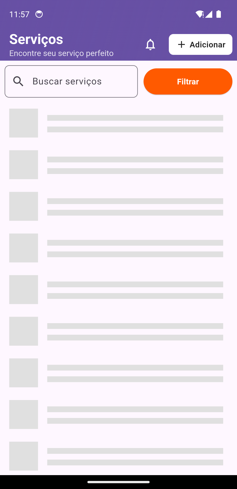
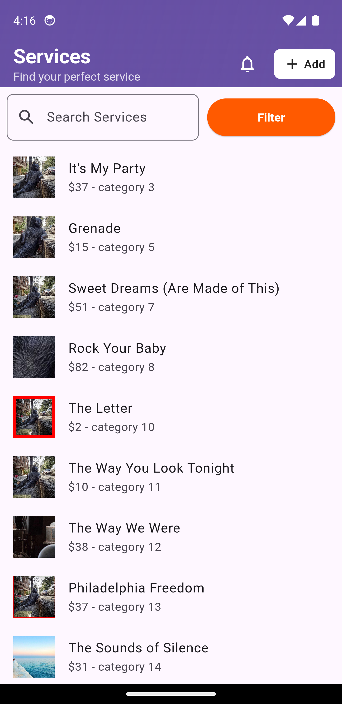
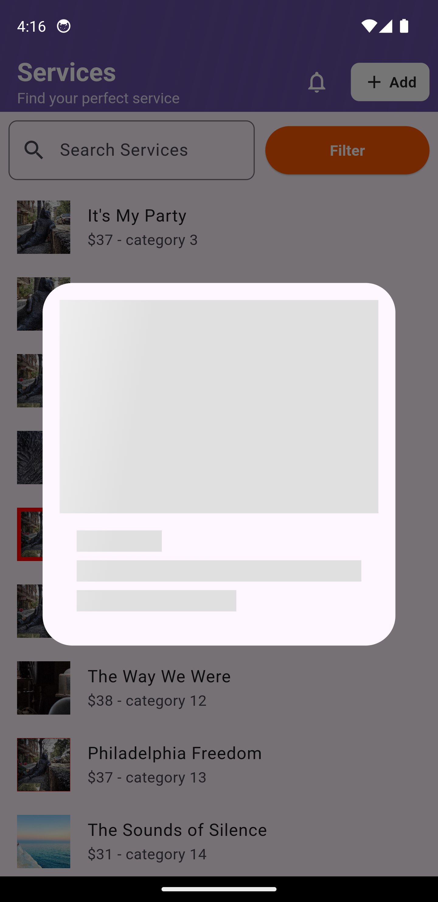
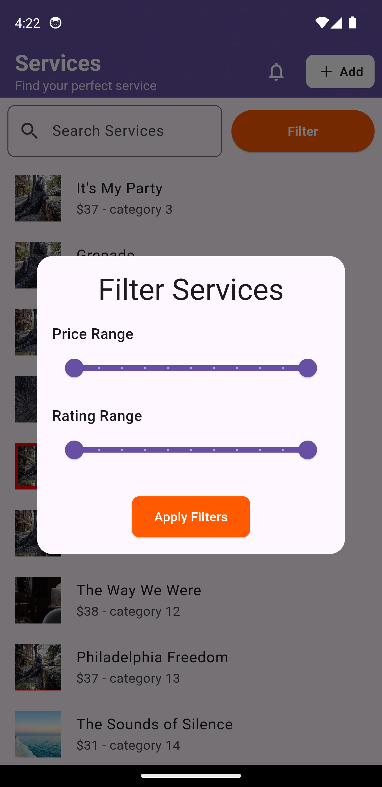
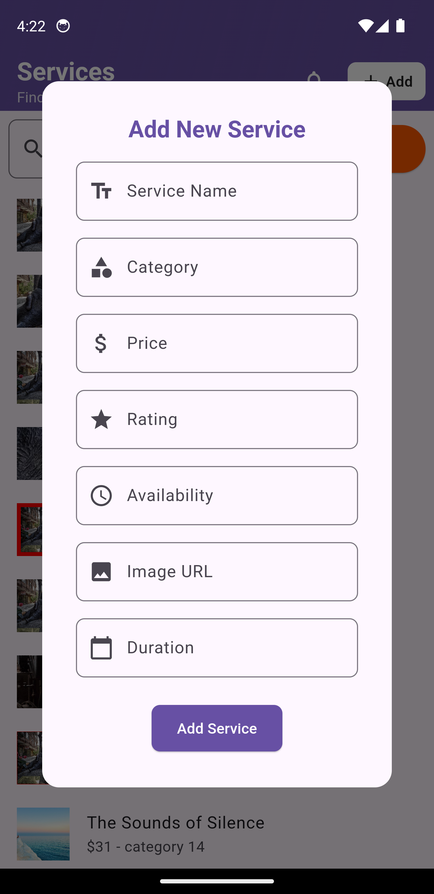
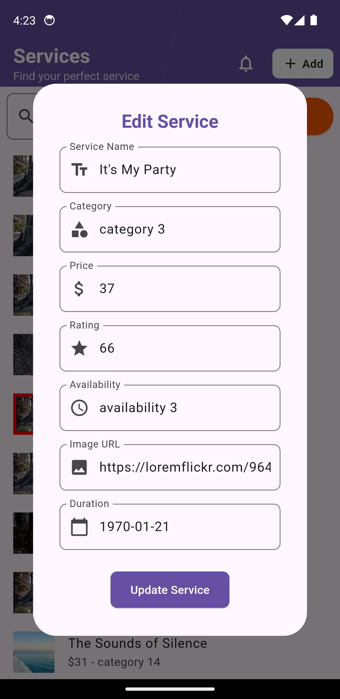

# Flutter GetX CRUD App

This is a Flutter project demonstrating the use of **GetX** for state management, routing, dependency injection, and more. It features a complete CRUD system along with:

- **Authentication Simulation**
- **Loading Indicators**
- **Snackbar Notifications**
- **Error Handling**
- **Search & Filtering**
- **Pagination**
- **Multi-language Support (Localization)**

## Features

### 1. Authentication Simulation

- Simulated login with hardcoded credentials.
- Use the following credentials to log in:
  - **Username:** `test`
  - **Password:** `test`

### 2. CRUD Operations

- Create, Read, Update, and Delete items using a reactive controller.
- Operations trigger appropriate loading indicators and feedback messages.

### 3. Loading States

- Custom loading overlay using `Obx` and GetX reactive states.

### 4. Snackbar Notifications

- Display success or error messages using `Get.snackbar`.

### 5. Error Handling

- Global error handling is integrated using try-catch blocks and controller methods.

### 6. Search & Filtering

- Real-time filtering of list data based on input text.
- Filter logic lives inside the controller.

### 7. Pagination

- Scroll-based or button-triggered pagination to load more data in chunks.

### 8. Multi-language Support

- Supports multiple languages using `.tr` method.
- Easily extendable for more locales via `translation.dart`.

## Screenshots

  

    
    
    
    
    
    
    
    
  

---

## Getting Started

### Prerequisites

- Flutter SDK
- Android Studio / VS Code
- Device or Emulator
